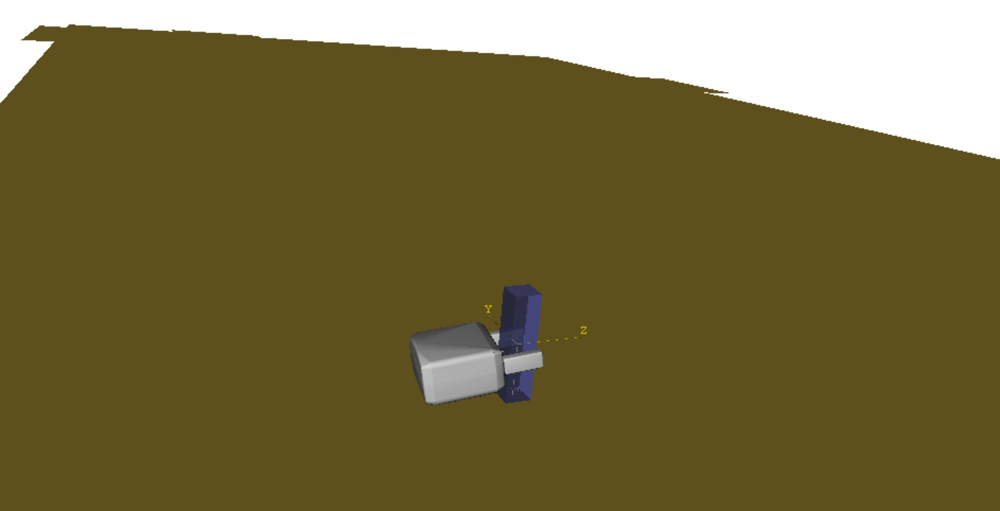
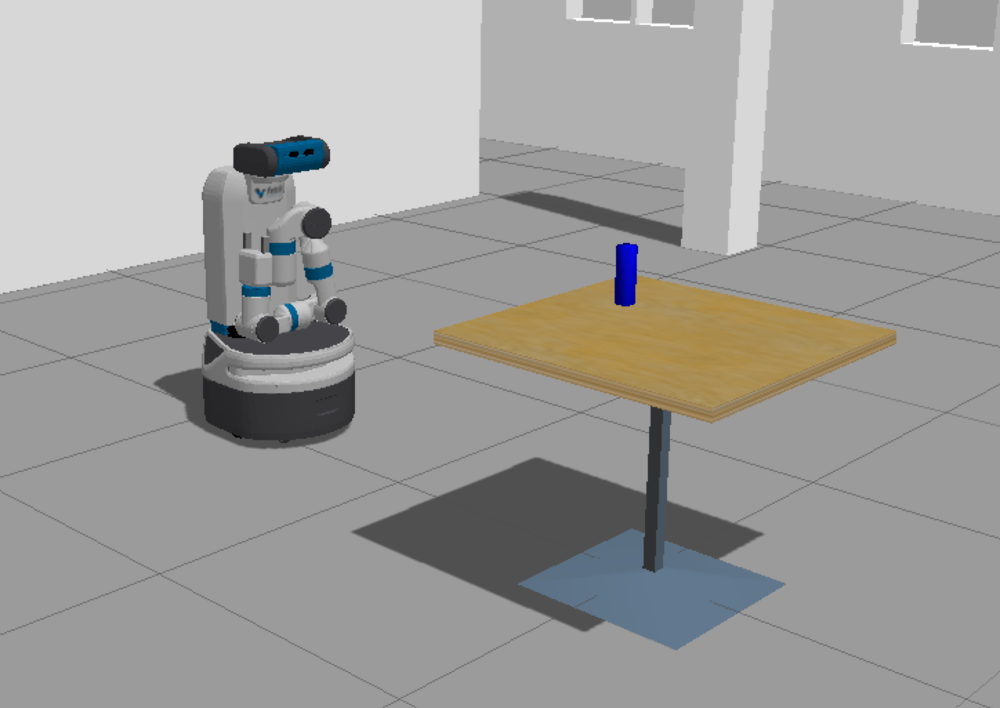
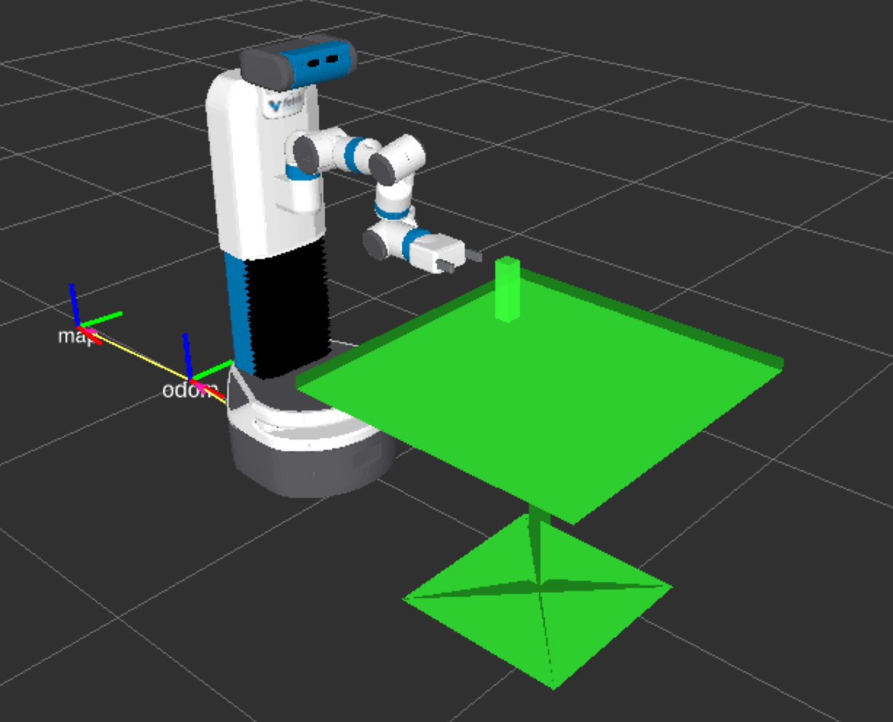

Homework for [COMSW6731 Humanoid Robots (SP19)](http://www.cs.columbia.edu/~allen/S19/) at Columbia University (Instructor: [Prof. Peter Allen](http://www.cs.columbia.edu/~allen/)).

# Workspace Preparation
You need to have a computer with Ubuntu 14.04 and ROS Indigo installed. If you choose to use Ubuntu 16.04 or ROS Kinectic, it is your own responsibility to make sure that it also works on Ubuntu 14.04 + ROS Indigo, on which we tested your submission. The ROS Indigo installation link is [here](http://wiki.ros.org/indigo/Installation/Ubuntu).

You might also want to install many dependencies if in need. Some helper commands can be found in [`clic_installation_14.04.sh`](https://github.com/jingxixu/humanoid-robots-s19/blob/master/clic_installation_14.04.sh) and [`clic_installation_16.04.sh`](https://github.com/jingxixu/humanoid-robots-s19/blob/master/clic_installation_16.04.sh).

After you have successfully installed Ubuntu and ROS, you should run the following commands to create a workspace
```
mkdir -p ~/homework_ws/src
cd ~/homework_ws
```

Clone the following repositories into your workspace which we will use later.
```
cd ~/homework_ws/src
git clone https://github.com/jingxixu/fetch_gazebo.git
git clone https://github.com/cse481wi18/cse481wi18.git
```

You need to switch to branch `gazebo2` of `fetch_gazebo`
```
cd ~/homework_ws/src/fetch_gazebo
git checkout gazebo2
```

Build this workspace and source it. Note, whenever you open a new terminal (unless you add this command to your `.bashrc` file), you need to source the `setup.bash` file.
```
cd ~/homework_ws
catkin_make
source devel/setup.bash
```

# Part 1: Basic Motion
In this part you need to control the robot to do a series of basic motions. See a video demo [here](https://youtu.be/e8qMkphO-_w).

## Prerequisites
We expect you to have already gone through the following tutorials before you start this part.

- At least the beginner level of [ROS tutorials](http://wiki.ros.org/ROS/Tutorials)
- [actionlib_tutorials](http://wiki.ros.org/actionlib_tutorials/Tutorials)
- At least week 3 of [cse481wi18](https://github.com/cse481wi18/cse481wi18/wiki). Note that we have already cloned its code in [workspace preparation]().

## Launch
Run this command to launch a Fetch robot with a playgroud in Gazebo.
```
roslaunch fetch_gazebo playground.launch x:=0.0 y:=0.0 z:=0.0
```


## Details
You are required to implement the following sequence of motions:
- move base forward 1.5 meters
- head looks down 45 degrees
- head looks up 90 degrees
- head looks left 90 degrees
- head looks right 90 degrees
- head looks forward
- raise torso to the maximum
- move arm to joint values `[0, 0, 0, 0, 0, 0, 0]`
- close gripper
- open gripper

You are allowed to use `fetch_api` package from the `cse481wi18` repositiry that you cloned. You should name your response `motion_demo.py` and it is recommended that you put it under `~/homework_ws/src/fetch_gazebo/fetch_gazebo_demo/scripts/`.

# Part 2: Using MoveIt!
This part is quite easy! You just need to show a video of you using MoveIt! RViz plugin to sample a random valid goal joint values for the arm group, plan and then execute. Then use the MotionPlanning - Slider to replay the plan or go over the plan by waypoints. See a video demo [here](https://youtu.be/WZ79UkOrjs0).

## Prerequisites
We expect you to have already gone through the following tutorials before you start this part.
- [Tutorial: MoveIt! RViz plugin](https://github.com/cse481wi18/cse481wi18/wiki/Tutorial%3A-MoveIt-RViz-plugin)
- [MoveIt! python interface](http://docs.ros.org/kinetic/api/moveit_tutorials/html/doc/move_group_python_interface/move_group_python_interface_tutorial.html#getting-started)

## Launch
Launch a Fetch robot with a playgroud in Gazebo
```
roslaunch fetch_gazebo playground.launch x:=0.0 y:=0.0 z:=0.0
```
Launch MoveIt! for Fetch
```
roslaunch fetch_moveit_config move_group.launch
```
Launch RViz (you might need to add a `RobotModel` and `MotionPlanning` visualization using the `add` botton)
```
rosrun rviz rviz
```


# Part 3: Using GraspIt!
In this part, you are required to create a scene in GraspIt! and generate grasps. See a video demo [here](https://youtu.be/Su8q62TXgzg).

## Prerequisites
Follow the instructions [here](https://github.com/CURG/graspit_commander) to install GraspIt! You should also go over those simple usage.

## Details
The graspable object you are using is `longBox` and the gripper is `fetch_gripper`. You are required to include a obstacle `floor` and put the `longBox` on the `floor` as shown in the following image. This requires you to figure out a right pose to load `longBox` and `floor` in GraspIt!. GraspIt! has built-in functions to load these objects which allows you to specify their poses. Name the python file `graspit_demo.py` and put it under `~/homework_ws/src/fetch_gazebo/fetch_gazebo_demo/scripts/`.



# Part 4: Pick Demo
In this part you are required to make the robot pick the long box using the grasp generated by GraspIt!. See a video demo [here](https://youtu.be/j5fzWVPW7YM).

## Launch
Launch a Fetch robot with a playgroud in Gazebo
```
roslaunch fetch_gazebo playground.launch
```

This time we do not specify where to start the robot so it is now at a default position, as shown in the below image. The long box on the table is the same as the one you used in part 3 so that the graps you generated will work for it.



## Details
You are required to make the robot:
- go to the table
- pick the object
- lift it up
- return to the original position

There are many ways to do it. The only requirement is that **you should not use perception and you are required to use the grasp generated by GraspIt!**.

Here are some hints. The grasps returned by GraspIt! is in the frame of the object. You need to transform them into using robot's base_link, so that you can call MoveIt inside your program to move the arm to that pose. You might want to look at Gazebo's [gazebo_msgs/GetModelState](http://docs.ros.org/jade/api/gazebo_msgs/html/srv/GetModelState.html) service and python package [tf.transformations](http://docs.ros.org/jade/api/tf/html/python/transformations.html). You will also need to deal with collision while using MoveIt!, you nend to add collision objects into the scene. An example of the created scene in MoveIt! is shown below. You might not need to create the exact scene as long as it works.



Name your python file `pick_demo` and put it under `~/homework_ws/src/fetch_gazebo/fetch_gazebo_demo/scripts/`. It is understandable if your script does not work 100% of the times, as there are too many unpredictable factors. But you need to at least get it work in your video demo.


# Submission
